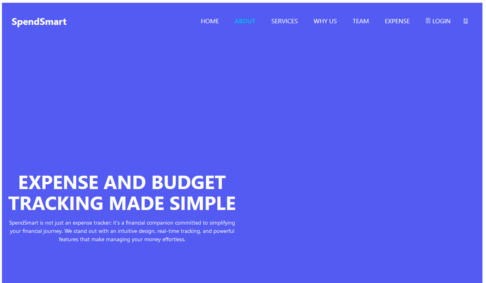

# Full-Stack-Project-3

Paragraph 1: What was the assignment or task?

The task for this group project was to create Expense Tracker app. We created it to learn how to use Full Stack Programming in our future jobs, and how to potentially create one that exceeds those existing in the current market. 

Paragraph 2: What was our motivation?

Our motivation behind building this project was to develop a user-friendly Expense Tracker app that provided what others in the field could not. We wanted to enhance the user experience, as well as understand the ropes behind Expense Tracker apps and sites.  

Paragraph 3: What problem does it solve?

Our Expense Tracker app allows you to create a profile and keep track of all your exepnses, It allows you to stay connected with your expenses and tracking

Paragraph 4: What did we learn? Why did we build this project?

Through building this project, we learned several valuable lessons. Firstly, we enhanced our skills in frontend web development, including HTML, CSS, and JavaScript, to create an interactive and visually appealing user interface. We also gained experience working with APIs. The project allowed us to apply our knowledge of Expense Tracker applications and integration into the real world. Additionally, we improved our collaboration and communication skills as we worked together as a team to divide tasks, share ideas, and ensure the successful completion of the project. 
Table of Contents

Paragraph 1: What was the assignment or task? Paragraph 2: What was your motivation? Paragraph 3: What problem does it solve? Paragraph 4 What did you learn? Why did you build this project?

Installation

N/A

Link to Live Website
https://expense-tracker-project-3-2a1b3229d2e3.herokuapp.com/

Tutorial Links:

W3Schools.com

License: MIT License

